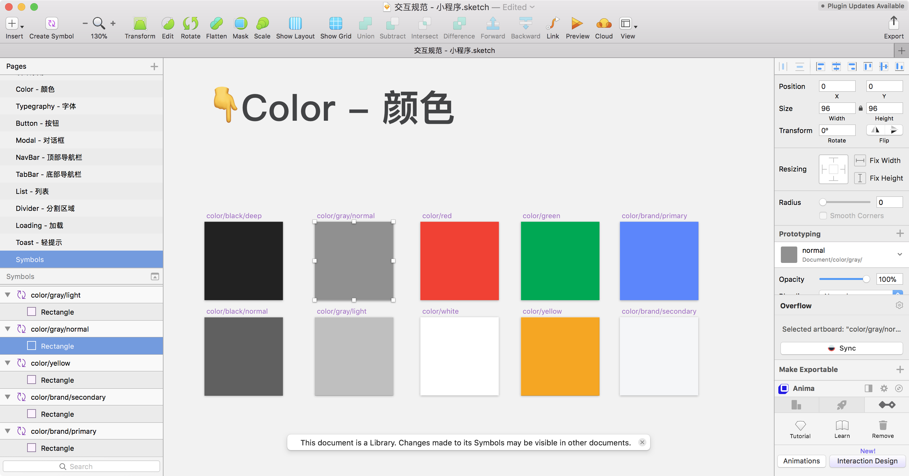
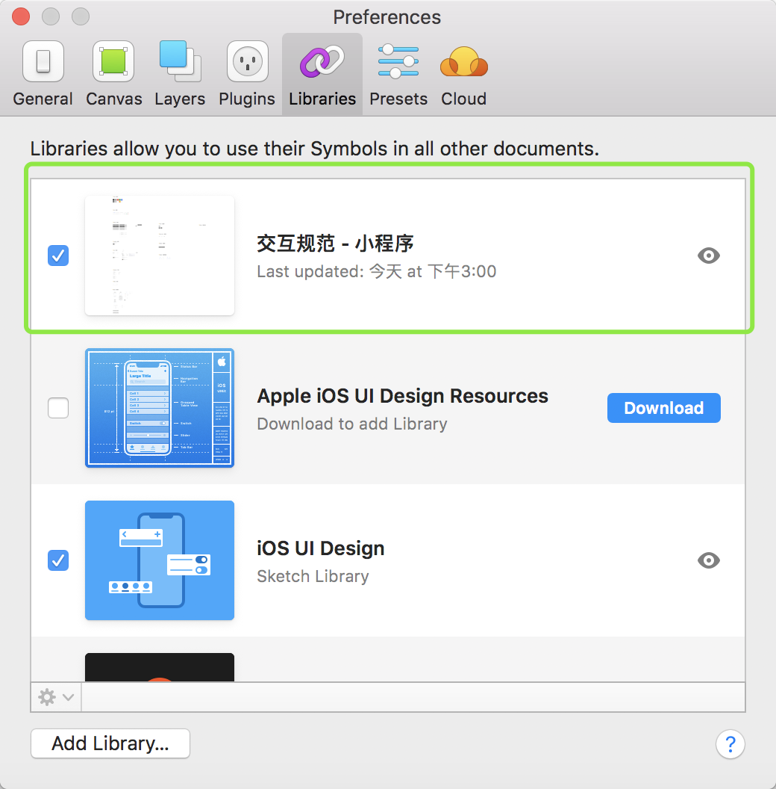
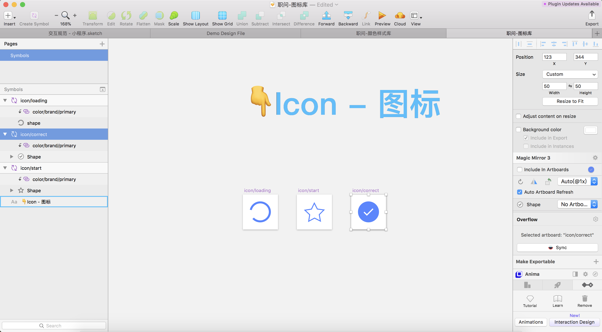
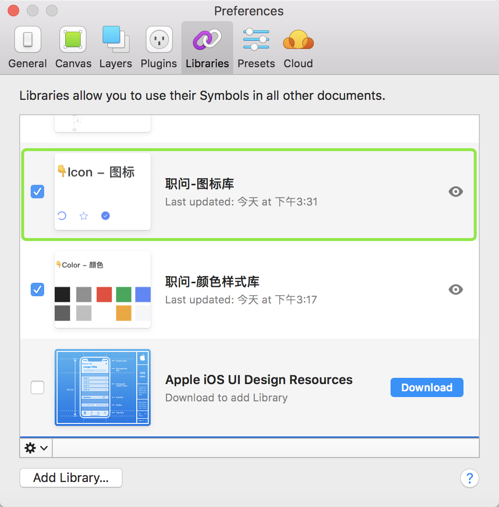
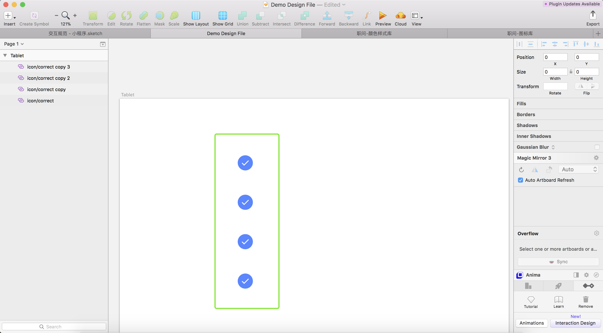
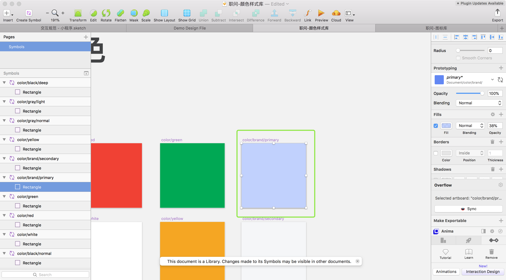
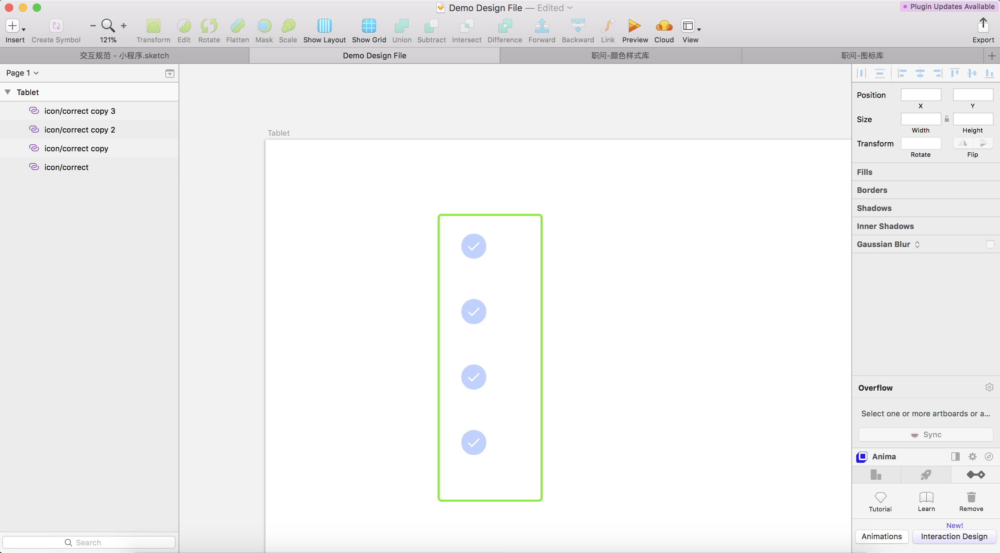

# 引言和客观存在的问题

设计规范是什么？
设计规范是指对设计的具体技术要求，是设计工作的规则。一般包括总体目标的技术描述、功能的技术描述、技术指标的技术描述,以及限制条件的技术描述等。———【百度百科】

具体看下图：

我们公司设计团队一直使用Sketch来进行设计，并且在空余时间，利用Sketch，更新设计规范。在Sketch47之前，Symbols一直是Sketch当中最为重要的功能之一，也是我个人非常喜欢并频繁使用的一项功能。Symbols用于创建可复用的界面元素或组件，有助于维护设计方案的一致性。然而一直以来，这一功能仅限于文档内部，除非借助第三方插件的帮助，否则Symbols无法在不同的Sketch文件之间保持同步。

为什么这是问题，如果团队规模小，设计师只有1到2位到无所谓。你可以将所有的流程图、组件Symbols、高保真设计稿都塞到一个sketch文件中。最多每次更改时，通过Airdrop丢给对方，再进行同步。这不会花太多精力。当团队有多名设计师时，又或者项目规模越来越大时，我们通常需要将项目打散到不同的Sketch文件当中；这时，Symbols同步共用方面的问题就会暴露出来。我们公司的设计规范是每个平台用一套即可。因此，挑战其实是，如果让多名设计师在一个项目设计不同功能或模块的同事，共用一套设计规范，并且保持同步性。

# 解决方案

Sketch 47推出了极具创新力但有非常实用的一项功能：Library
什么是Library？官方是这么定义的：

一个Library本质上就是一个普通的Sketch文件，其中的Symbols可以被其他Sketch文件调用。如果你编辑了Library当中的Symbols，那么调用了该Library的其他Sketch文件便会收到更新通知，你可以对变更进行预览、对比和确认，使这些Sketch文件所调用的Symbols自动更新至最新版本。

Library功能可以帮助我们创建独立的、能够被多个文件统一调用的Symbols库。不仅如此，我们还可以对Libraries进行嵌套（Nested Symbol）。
大体上讲，如今你可以将不同类型的Symbols存放在一个Sketch文件，譬如颜色、图标、按钮、列表等等；其他设计师分出的设计文件则可以统一调用这些源Sketch文件当中的Symbols。当某人修改了这个源文件下Symbol样式或内容，相应的变化也会同步更新到所有的项目文件当中。

#废话不多说直接看例子

1、颜色定义：
在Library文件的Symbol页中创建几个矩形Symbol，更改其颜色，将每一种颜色生成一个Shared Style，并按照你团队自己的逻辑进行分类，比如我们交互设计环节，只会用到黑、灰和一些特定的亮色。具体的分类方式就是在Shared Style命名当中通过「/」符号表示层级结构，Sketch会识别到该符号，并自动生成相应的架构。

2、将颜色定义Library文件添加至你的设计文件中使用:
另创建一个文件，当做你的设计工作文件。在顶部菜单栏选择「Sketch › Preferences」，然后进入「Libraries」选项，点击“Add Library」按钮，选择我们在上一步里创建的Sketch文档。

3、图标定义:
在另一个Library文件的Symbol页中创建简单的图标，每个图标都被放置在相同规格的50*50像素的画板当中.。然后我会颜色定义的Library库中选择恰当的颜色Symbol插入到图标画板当中，覆盖在图标图层之上。接下来，将图标设置为蒙板「按住Control键，点选图标，在菜单中选择Mask」，如此一来，我们刚刚从颜色定义的Library文件中插入的Symbol就能将其颜色附着到图标形状的蒙板上了。

4、将图标定义Library文件添加至你的设计文件中使用:
在刚刚你创建的文件（当做你的设计工作文件）中，在顶部菜单栏选择「Sketch › Preferences」，然后进入「Libraries」选项，点击“Add Library」按钮，选择我们在上一步里创建的Sketch文档。

5、应用:
在你的设计文件中，如你想使用我们定义好的图标，则直接在图标定义的Library库中选择相应的图标插入到你的画板中。

这时，你有可能图标中，蓝色的饱和度不太满意。在之前，如图，你需要手动的未每个图标进行颜色更换。而现在，你只需修改颜色定义的Library中的颜色值即可同步到使用相应颜色的设计文件中。

修改完颜色定义的Library文件的颜色后，切回到图标定义的Library文件中，右上角有提示更新，点击更新，图标的颜色会自动更新。
随之设计文件中的图标也会自动更新！

是不是很方便，很酷炫！
下一期将结合Nested Symbol继续深入讲解......

